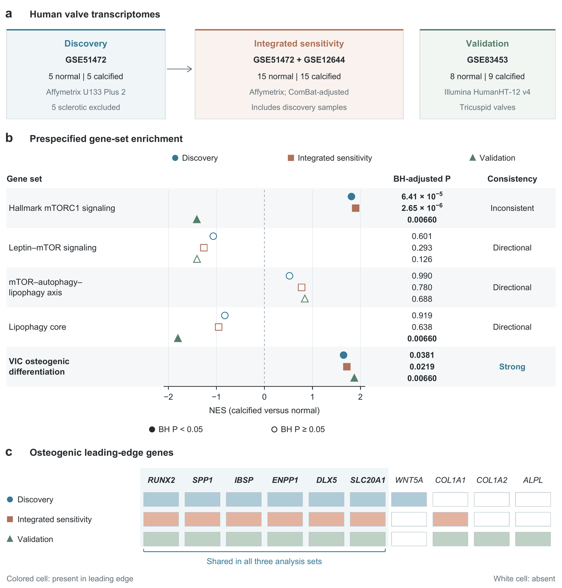

# CAVD_GSEA

Reproducible transcriptomic analyses of calcific aortic valve disease supporting *Leptin promotes osteogenic differentiation with mTORC1 activation, impaired autophagic flux and lipid droplet accumulation in human valvular interstitial cells*.

**Manuscript release: v1.0.0 (7 October 2026).** The current results are in [`results/current/`](results/current/) and the current main figure is in [`figures/current/`](figures/current/). The historical analysis, plans and results remain at their original paths and commits. See the [reporting corrections](docs/REPORTING_CORRECTIONS_2026-10-07.md) before using historical NES uncertainty columns or old figure numbers.



## What is included

- The frozen GSEA plans, implementation, curated gene sets, annotations and archived results.
- Current results for all 68 reported tests, with the deprecated uncertainty columns removed.
- The 15 targeted pathway results, the 10-gene osteogenic leading-edge membership matrix, and the final Figure 1 export script.
- The transcriptomic supplementary figure sources and a map from historical to current figure numbers.
- Public GEO input retrieval, SHA-256 checks, an R environment specification, isolated analysis entry points and actual reproduction records.
- Citation metadata, explicit licenses and GitHub-to-Zenodo release metadata.

This archive covers the transcriptomic component of the study. Western blot, ALP, mineralization and microscopy source data are documented in the manuscript's separate supplementary and source-data packages.

## Study design and result structure

| Analysis set | Source | Normal / calcified | Role |
| --- | --- | ---: | --- |
| Discovery | GSE51472 | 5 / 5 | Primary pathway inference |
| Integrated | GSE51472 + GSE12644 | 15 / 15 | Sensitivity analysis; includes discovery samples |
| Cross-platform validation | GSE83453 | 8 / 9 | Tricuspid-valve comparison |

The three GEO studies contribute 47 unique samples. The five sclerotic GSE51472 samples and ten bicuspid GSE83453 samples are excluded from these contrasts. The integrated set retains study-related separation after ComBat and is interpreted as a sensitivity analysis.

Five targeted gene sets are tested in each analysis set, with Benjamini–Hochberg adjustment within each five-test pool. The 50-Hallmark descriptive analysis is performed only in discovery. S100A9–RAGE is a separate supplementary single-set analysis in each analysis set. The full result table contains 15 targeted, 3 supplementary and 50 descriptive results.

## Quick start: rebuild current tables and Figure 1

Use Python 3.10 or later and install the figure dependencies in an environment of your choice:

```sh
python3 -m pip install -r environment/requirements-figure.txt
python3 scripts/build_current_release.py
```

Full figure export also uses Poppler (`pdftoppm`). The builder selects Arial when available and Liberation Sans otherwise; the font is recorded in the build report. For numerical exports and validation only:

```sh
python3 scripts/build_current_release.py --data-only
```

This builds the current tables from the preserved results. The final main figure reports NES point estimates and adjusted P values, without the historical bootstrap-derived intervals.

## Reproduce the analysis from public expression matrices

```sh
python3 scripts/fetch_geo_inputs.py
Rscript --vanilla environment/restore.R
Rscript --vanilla scripts/run_analysis.R --output-dir runs/reproduction --mode gsea
```

See [REPRODUCIBILITY.md](docs/REPRODUCIBILITY.md) for versions, input hashes, baseline analyses, output locations and command options. The wrapper disables the deprecated uncertainty calculation and preserves the core preprocessing, rankings, gene sets, seeds and GSEA parameters.

### Verified on 7 October 2026

- Fresh public downloads of all three GEO series matrices matched the original analysis inputs byte for byte.
- A complete GSEA rerun reproduced all 68 rows and all 13 retained result fields exactly, including ordered leading-edge lists.
- The two main-figure source CSVs, SVG and legend match the manuscript release; the PNG and TIFF match its pixels. Repeated current-figure builds produced identical files.
- Eight historical baseline panels and the separate ComBat diagnostic matched rendered pixels and extracted text. The live KEGG panel changed with the online annotation service; the archived panel remains the manuscript artifact.
- The recorded R environment was used successfully. Restoring every package into an empty library has not been tested.

Details are in [`docs/validation/`](docs/validation/). Baseline KEGG version dependence and the historical NES-interval correction are documented explicitly.

## Repository map

| Path | Contents |
| --- | --- |
| `pre/`, `preregistration/` | Preserved historical plans, implementation and gene-set definitions |
| `results/` outside `current/` | Preserved historical outputs and historical figure names |
| `results/current/` | Current manuscript tables and main-figure numerical sources |
| `figures/current/` | Current main figure, previews and supplementary transcriptomic figures |
| `scripts/` | Data retrieval, isolated R reruns and current figure generation |
| `environment/` | Input/source checksums, package versions and restoration instructions |
| `docs/` | Corrections, figure mapping, reproduction instructions and verification records |
| `CITATION.cff`, `.zenodo.json` | Author and release metadata |

## Versions and citation

The analysis provenance is preserved through these commits:

- `ed2d35d`: plan v1, 23 May 2026 (`prereg-frozen`).
- `c76f644`: plan v2 and amendment, 26 May 2026 (`prereg-frozen-v2`).
- `6d6a7cd`: analysis implementation committed before the saved results.
- `18f0f7f`: saved GSEA v2 results, 26 May 2026 (`gsea-run-v2`).
- `0fe1758`: historical baseline figure exports, 28 May 2026.

The dated manuscript-release corrections preserve this history. They do not redefine the historical plans as if the release-stage corrections had been prospective.

Please cite the released software archive using [`CITATION.cff`](CITATION.cff). Authors: **Zongyue Li and Yanhu Wu**, First Affiliated Hospital with Nanjing Medical University. The repository's GitHub release is the source for its corresponding Zenodo software archive.

## Licenses

Code is licensed under the [MIT License](LICENSE). Author-created result tables, figure outputs and documentation are licensed under [CC BY 4.0](LICENSES/CC-BY-4.0.txt); see [LICENSES/README.md](LICENSES/README.md) for scope. Public GEO inputs are retrieved from their original source and are not included in release archives. Third-party resources and software retain their original terms.
